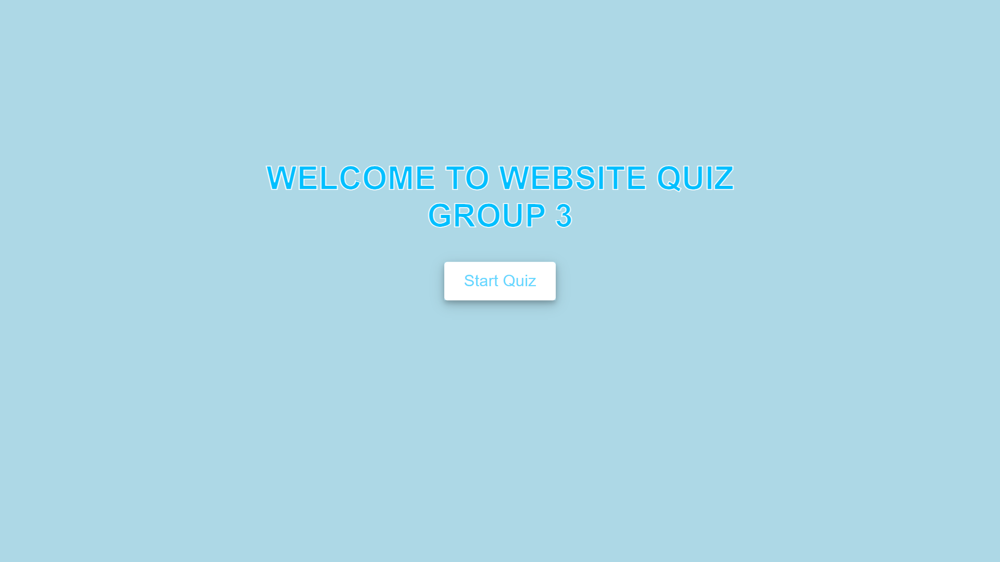
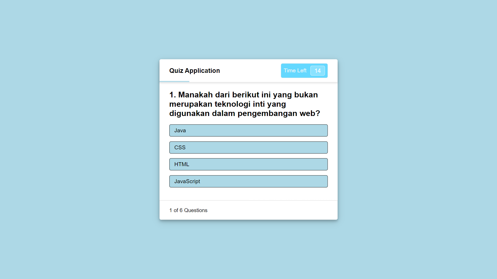
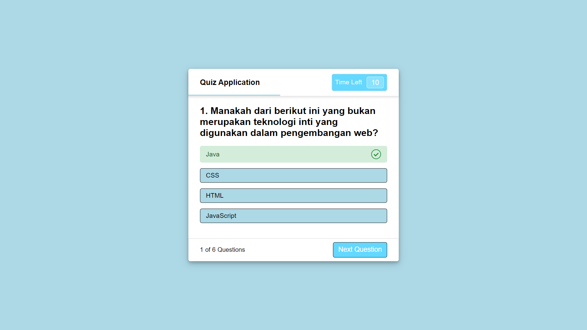
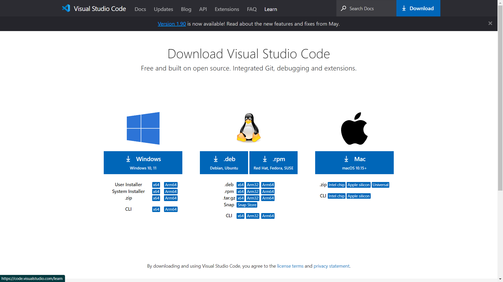

# Web Quiz

This Web Quiz is a simple website to do a question from the program we have created. We made this program to complete the big task 2 of the web programming course taught by lecturer ZICO ALAMSYAH, S.SI, MTI. Group members consist of :


## Authors

- [Muhamad Nur Arif (41523010147)](https://arifsuz.vercel.app/)
- [Bagas Indra Lesmana (41523010002)](https://github.com/bagasil123)
- [Aubrel Ibrahim (41523010102)](https://github.com/cynafx)
## Features

- Display questions one by one.
- Displays the answer options for each question.
- Calculates and displays the final score after all questions have been answered.
- Displays the result of each answer whether it is correct or incorrect.
## Documentation

### HTML
HTML is a markup language that browsers use to interpret and write text, images and other materials into web pages visually and audibly. The basic characteristics for each item of HTML markup are defined in the browser. This `index.html` file functions as its main function, which is to create the appearance and structure of a tag that becomes a content on our website.

### CSS
Cascading Style Sheet (CSS) is a rule to organize several components in a web so that it will be more structured and uniform. In the website program that we created the `style.css` file in the `src/css/style.css` folder is used to create and add styles to the website display so as to make it more attractive and pleasant to look at and read, and css also functions to make the display more structured and make the website more beautiful.

### Javascript
JavaScript is one of the core technologies of the World Wide Web besides HTML and CSS. JavaScript helps make web pages interactive and is an essential part of web applications. The Javascript function in our program aims to make this website program work and program the system and how the website works according to its function. There are 2 Javascript files in the `src/js` folder in this website program, namely the :
1. **Script.js:** this file serves to provide interactivity and functionality to web pages. The functions loaded in it can vary depending on the needs and complexity of the web page. Here are some common functions of script.js:

- *DOM manipulation*: Using JavaScript, you can dynamically change the structure, style, and content of a web page. This includes adding, removing, or changing HTML elements, responding to user interactions such as clicks or swipes, and others.

- *Interaction with Users*: JavaScript allows you to create a more dynamic user experience by responding to user actions, such as form filling, input validation, displaying notifications, and more.

- *Animation*: Script.js can be used to create animations, be it the movement of elements, color changes, or other effects that improve the interaction and visual appeal of web pages.

- *Form Validation*: When a user fills out a form on a web page, JavaScript can be used to validate the user's input before the data is submitted to the server, ensuring that the data entered matches the desired format.

- *Event Management*: JavaScript allows you to handle a wide variety of events, such as click, slide, hover, and so on. This allows developers to create responsive and interactive web applications.

2. **Questions.js:** This file serves to store questions in the form of an array object with the list data type, making it easier to add, delete, or change the contents of the question data. As well as making the program more efficient and effective in writing and reading the program.
## Installation

Install this project :

```bash
  git clone https://github.com/Pemrograman-Web-VT-D-101/Web-Quiz.git
```
after you clone the repository, the project folder will be in the location you used during the clone process, you can run the program by opening the `index.html` file and running it by running with live server or using the extension to run the html program.
## Requirements & Suggestions
1. Make sure you have **Visual Studio Code** installed or you can download and install by clicking the link in the Support section. This serves as a code editor to help you write and create programs.
2. It is recommended to install the **Live Server** extension that you can download in Visual Studio Code to make it easier to develop or see the results of the program.
## Screenshots









## Support

### [Visual Studio Code](https://code.visualstudio.com/download)


### [LiveServer](https://marketplace.visualstudio.com/items?itemName=ritwickdey.LiveServer)


## Created by

### This project was created by :

**Muhamad Nur Arif (41523010147) :**
- [Linkedin](https://www.linkedin.com/in/marif8/)
- [GitHub](https://github.com/arifsuz)
- [Portofolio](https://arifsuz.vercel.app/)
- [Instgram](https://instagram.com/arif_suz/)

**Bagas Indra Lesmana (41523010002) :**
- [GitHub](https://github.com/bagasil123)

**Aubrel Ibrahim (41523010102) :**
- [GitHub](https://github.com/cynafx)